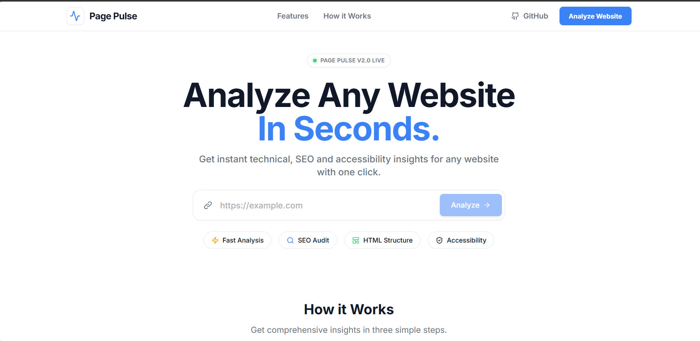

# Page Pulse – Website Audit Tool

<div align="center">
  
  
  
  
  
  
  
</div>

<br />

Page Pulse is a high-performance, full-stack website analysis tool designed to instantly evaluate the technical health and search engine visibility of any public webpage. By simply providing a URL, the system dynamically fetches the page, parses the HTML structure, and generates a comprehensive audit report detailing critical SEO metrics, accessibility faults, and response performance.

---

## 📑 Table of Contents

- [Features](#-features)
- [Tech Stack](#-tech-stack)
- [Project Structure](#-project-structure)
- [How It Works](#-how-it-works)
- [API Documentation](#-api-documentation)
- [Installation](#-installation)
- [Run Tests](#-run-tests)
- [Error Handling](#-error-handling)
- [Design Decisions](#-design-decisions)
- [Screenshots](#-screenshots)
- [Future Improvements](#-future-improvements)
- [Author](#-author)
- [License](#-license)

---

## ✨ Features

- **Analyze Any Website URL:** Instantly scan any public web address.
- **HTTP Status & Protocol Detection:** Verify server health (e.g., 200 OK) and connection security (HTTPS).
- **Response Time Measurement:** Accurate latency tracking for server responses.
- **SEO Metric Extraction:** Automated retrieval of Page Titles and Meta Descriptions.
- **Content Analysis:** Dynamic Word Count and `<h1>` Tag Count evaluations.
- **Accessibility Checks:** Detection of images missing `alt` attributes.
- **Proprietary SEO Score:** Algorithmic grading based on technical health parameters.
- **Report Export:** Instantly **Copy JSON** or **Download JSON** for external use.
- **Modern UX:** Sleek loading animations and a responsive, high-fidelity light theme interface.
- **Robust Error Handling:** Graceful degradation for invalid URLs, timeouts, and non-HTML content.

---

## 🛠 Tech Stack

### Frontend
- **React** (Component-based UI)
- **Vite** (Lightning-fast build tool)
- **Tailwind CSS** (Utility-first styling)
- **Axios** (HTTP client for API interactions)

### Backend
- **Flask** (Lightweight WSGI Python web application framework)
- **BeautifulSoup4** (HTML parsing and extraction)
- **Requests** (Synchronous HTTP requests for fetching pages)

### Testing & Deployment
- **Pytest** (Backend unit and integration testing)
- **Vercel** (Frontend Hosting)
- **Render** (Backend Hosting)

---

## 📂 Project Structure

```text
.
├── backend/
│   ├── models/           # Data models and structures
│   ├── routes/           # Flask API endpoints
│   ├── services/         # Core auditing logic and HTML parsing
│   ├── tests/            # Pytest test suites
│   ├── app.py            # Flask application entry point
│   └── requirements.txt  # Python dependencies
├── frontend/
│   ├── public/           # Static assets
│   ├── src/
│   │   ├── components/   # Reusable UI React components
│   │   ├── pages/        # Main route views
│   │   ├── services/     # API integration logic
│   │   ├── App.jsx       # Root React component
│   │   └── main.jsx      # React DOM rendering
│   ├── package.json      # Node dependencies
│   ├── tailwind.config.js# Tailwind theme configuration
│   └── vite.config.js    # Vite bundler configuration
├── .gitignore
└── README.md
```

---

## 🔄 How It Works

The architecture follows a decoupled client-server model to ensure fast, scalable processing:

1. **User enters URL** in the React frontend.
2. **↓ Frontend sends POST request** via Axios to the backend API.
3. **↓ Flask fetches webpage** using the Python `requests` library.
4. **↓ BeautifulSoup parses HTML** to construct a navigable DOM tree.
5. **↓ Backend extracts metrics** (Title, Meta, Word Count, Accessibility).
6. **↓ JSON returned** with the calculated SEO score and structured data.
7. **↓ Frontend displays report** in a clean, professional dashboard.

---

## 📡 API Documentation

### **Analyze Endpoint**

Initiates a technical audit on a specified URL.

| Method | Endpoint | Description |
| :--- | :--- | :--- |
| `POST` | `/api/analyze` | Returns a JSON report of the audited website. |

#### **Request Example**

```json
{
  "url": "https://example.com"
}
```

#### **Response Example**

```json
{
  "status_code": 200,
  "protocol": "HTTPS",
  "response_time": "124ms",
  "title": "Example Domain",
  "meta_description": "None",
  "word_count": 215,
  "h1_count": 1,
  "images_missing_alt": 0,
  "seo_score": 98
}
```

---

## 🚀 Installation

Follow these steps to run the project locally.

### Backend Setup

```bash
# Navigate to the backend directory
cd backend

# Install Python dependencies
pip install -r requirements.txt

# Start the Flask development server
python app.py
```
*The backend will run on `http://localhost:5000`*

### Frontend Setup

```bash
# Navigate to the frontend directory
cd frontend

# Install Node dependencies
npm install

# Start the Vite development server
npm run dev
```
*The frontend will run on `http://localhost:5173`*

---

## 🌐 Deployment

The project is pre-configured for seamless deployment to Vercel (Frontend) and Render (Backend).

### Backend (Render)
1. Create a new **Web Service** on Render and connect your GitHub repository.
2. Set the Root Directory to `backend`.
3. Set the Build Command: `pip install -r requirements.txt`
4. Set the Start Command: `gunicorn app:app`
5. Add the following Environment Variables in the Render dashboard:
   - `FRONTEND_URL`: URL of your deployed Vercel frontend.
   - `PYTHON_VERSION`: `3.12.6` (or your local python version)

### Frontend (Vercel)
1. Create a new **Project** on Vercel and connect your GitHub repository.
2. Set the Framework Preset to **Vite**.
3. Set the Root Directory to `frontend`.
4. Add the following Environment Variable in the Vercel dashboard:
   - `VITE_API_URL`: URL of your deployed Render backend (e.g., `https://pagepulse-api.onrender.com`).
5. Click **Deploy**. Vercel will automatically run `npm install` and `npm run build`.

---

## 🧪 Run Tests

The backend includes a comprehensive test suite to ensure the reliability of the auditing logic.

```bash
# Run all tests
pytest

# Run tests with verbose output
pytest -v
```

**Test Coverage Includes:**
- Successful URL analysis and metric extraction.
- Validation of the SEO Score calculation logic.
- HTTP error simulations (404 Not Found, 500 Internal Server Error).
- Edge cases (e.g., Non-HTML content types, connection timeouts, invalid URL formats).

---

## ⚠️ Error Handling

The API is built to gracefully handle unstable web environments. The frontend will display specific error states for:

- **Invalid URL:** Malformed strings or missing schemas.
- **Connection Error:** Unreachable domains or DNS failures.
- **Timeout:** Servers taking too long to respond.
- **404 Pages:** Valid domains but missing paths.
- **500 Pages:** Target server internal errors.
- **Non-HTML Content:** Attempting to analyze PDFs, images, or raw JSON instead of web pages.

---

## 💡 Design Decisions

- **Flask:** Chosen for its lightweight, micro-framework architecture. Since the backend strictly serves as a REST API processor for HTML fetching without needing a complex ORM or templating engine, Flask provided the fastest development velocity and lowest overhead.
- **BeautifulSoup4:** Selected as the HTML parser due to its resilience with malformed markup. It is the industry standard for Python web scraping and reliably extracts DOM elements faster than headless browser alternatives (like Puppeteer/Selenium) when JS execution isn't strictly required.
- **React + Tailwind CSS:** React allows for an interactive, state-driven dashboard experience (essential for loading states and error handling), while Tailwind CSS enables rapid implementation of a premium, enterprise-grade design system without bloated custom CSS files.
- **SEO Score Calculation:** The SEO score is an algorithmic baseline starting at 100. Points are deducted based on critical technical faults (e.g., -10 for missing Page Title, -15 for missing H1 tags, -5 for missing image alt attributes). This gives users immediate, actionable feedback on their site's health.

---

## 📸 Screenshots

<p align="center">
  
  
</p>
<p align="center">
  
  
</p>

---

## 🚀 Future Improvements

- **Lighthouse Integration:** Connect to Google's Lighthouse API for deeper Core Web Vitals metrics.
- **PDF Export:** Allow users to download visually formatted PDF reports for clients.
- **Historical Reports:** Implement a database (e.g., PostgreSQL) to track a website's health over time.
- **Multi-page Crawl:** Expand the tool to crawl an entire domain map rather than a single URL.
- **Performance Charts:** Visualize response time latency and DOM size using Recharts.

---

## 👨‍💻 Author

**Somya Agarwal**
- GitHub: [@somya-agarwal2](https://github.com/somya-agarwal2)
- LinkedIn: [Somya Agarwal](https://linkedin.com/in/somya-agarwal2)

---

## 📄 License

This project is licensed under the [MIT License](LICENSE).
